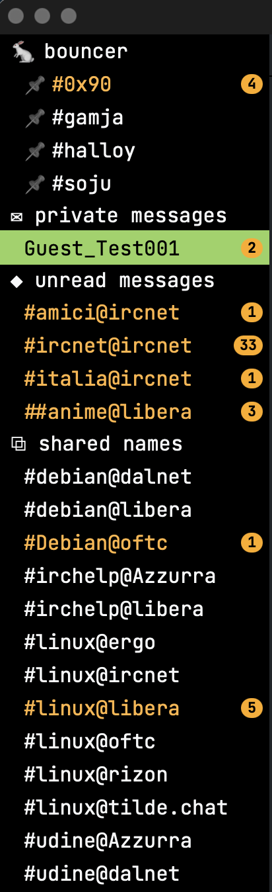

# gamja — customizations

Customizations for [gamja](https://codeberg.org/emersion/gamja), the web IRC client, as used in front
of a [soju](https://codeberg.org/emersion/soju) bouncer. `custom.css` + `custom.js` sit beside gamja's
bundle and never touch it, so they survive a rebuild — a few features also need the patches below.
Desktop only.

**Tested against gamja `master` at [`cdf94d6`](https://codeberg.org/emersion/gamja/commit/cdf94d6)
(2026-07-24).** Follow `master`, not the tags: the latest release, `v1.0.0-beta.11`, is from 2025-03-20
and 54 commits behind. These files hook gamja's DOM and CSS variables, not a stable API, so a newer
`master` can move things underneath them.


## What it adds

  

- **Extra panel** next to *Settings*, in two tabs: **29 theme colours**, each row drawn with the colours
  it sets, and the options below. *Reset* restores every default and leaves pinned channels alone.
- **Channel list**: 📌 pinning, marks for the bouncer and the networks, private messages in their own
  block, optional grouping of names shared across networks as `#channel@network` (the ⧉ block above),
  optional **unread on top** — a conditional pin: loose channels with unread messages gather in the ◆
  block and go home once read — an unread **dot** on either side or an unread **count** as a badge,
  long nicks shortened.
- **Runs of messages**: repeated nick and timestamp dropped, wrapped lines indented into the text column.
- **⟳ reload** in the buffer header, for a channel that renders empty after joining.
- **`/paste`**: one message per line, or uploaded to dpaste.com and sent as a link — ⚠️ that leaves the
  network and expires in 7 days.
- **`/image`**: a picture chosen or dragged in goes to litterbox.catbox.moe and the link is sent — ⚠️ it
  leaves the network, and expires after the time set in the panel (1h to 72h).
- **`/list`** dialog, sortable and filterable. **Buffer search** with ⌘F over the rendered lines.
- **Image preview** and **link confirmation**, both off by default — ⚠️ the preview needs `img-src` in
  the page's CSP, see `index.html.example`.
- **`/ignore <nick>`** hides that person's lines, by **nick and host**, so a nick change does not defeat
  it; **`/ignoretext <words>`** hides any message containing them, whoever wrote it. Either command
  without an argument opens the list (as does *Ignored people* in the panel); `/unignore` and
  `/unignoretext` remove. An ignored line does not mark the buffer unread, count, or notify.
  ⚠️ Local only: the messages arrive and soju stores them, so another client shows them.
- **Text shortcuts** `:shrug` `:tableflip` `:unflip`, on send and in what you receive.
- **Timestamp as plain text**, so a selection can start there; the permalink is an option.
- **Command history** ↑/↓, readable `/help`, working Option+letter shortcuts on macOS, `Alt+↑/↓` in the
  order you see.
- **Forced dark theme** with self-hosted JetBrains Mono.

Why any of it is done the way it is: [notes.md](notes.md). The code is commented where it matters.

## Install

1. Copy `custom.css`, `custom.js` and `fonts/` into your gamja directory.
2. In `index.html`, **after** the bundle tags:

   ```html
   <link rel=stylesheet href="custom.css?v=1">
   <script src="custom.js?v=1"></script>
   ```

   ⚠️ Bump `?v=N` on every change, or browsers keep serving the old file. Serve `index.html`,
   `config.json`, `custom.css` and `custom.js` as `Cache-Control: no-store`; the bundle and the fonts
   carry a content hash in their name and can be cached forever.

3. Copy `config.json.example` to `config.json` and point it at your own bouncer's WebSocket endpoint.
   ⚠️ It **must be on the same origin** as the page, or soju refuses the connection (*"request Origin
   … is not authorized for Host …"*). Nick, autojoin and networks are configured in soju, not here.
4. For `/list`, the unread count and the growing composer, apply the patches in [`patches/`](patches).

## Patches for gamja itself

Four features need gamja to report or do something it does not on its own, and four are plain gamja
defects. All eight are in [`patches/`](patches), against gamja **master** (`cdf94d6`) — source, not
edits to a built file. Verified in this order on a clean clone (`eslint` clean, `parcel` builds):

```sh
git clone https://codeberg.org/emersion/gamja.git && cd gamja
git apply ../gamja-lab/patches/*.patch
npm install && npm run build          # one build, dist/ is what you deploy
```

| Patch | What it does | Needed by |
|---|---|---|
| `0001` | reports the unread transitions to the page | Unread count |
| `0002` | emits a `gamja-list` event with the LIST replies | `/list` dialog |
| `0003` | the *Open buffer* dialog can be dismissed | — |
| `0004` | a slow JOIN no longer drags you out of what you are reading | — |
| `0005` | history is requested for a buffer that renders empty | ⟳ rarely needed |
| `0006` | the composer grows with the text (Enter sends, Shift+Enter breaks the line) | long messages |
| `0007` | no unread flag without messages behind it | Unread count (no `?`) |
| `0008` | the page can veto the unread state of a message | `/ignore` |

💡 The hooks stay thin on purpose: gamja keeps the state it already kept, the tally lives on the page,
and nothing polls or observes the DOM. Unpatched, gamja runs fine — it keeps the defects, and the
features above stay off. The *Extra* panel says so and greys the switch out.

Without a build step, three of the defects can be hand-edited into `build.*.js`:
[bundle-fixes.md](bundle-fixes.md). ⚠️ Never reuse a bundle filename that has already been served:
browsers keep the old file, and you end up debugging code that is not there.

⚠️ Do **not** wrap `window.WebSocket` to intercept `/list`. That was the first attempt, together with a
document-wide observer, and it left gamja sluggish with messages flickering in and out.

## More

- [**Optional bundle fixes**](bundle-fixes.md) — three gamja defects, without rebuilding.
- [**Notes**](notes.md) — the traps behind the choices.

## Licenses

`custom.css` and `custom.js` are original work. gamja itself is **AGPL-3.0** and is not included here.
**JetBrains Mono** is under the **SIL Open Font License 1.1**, shipped with the fonts in
[`fonts/OFL.txt`](fonts/OFL.txt).
