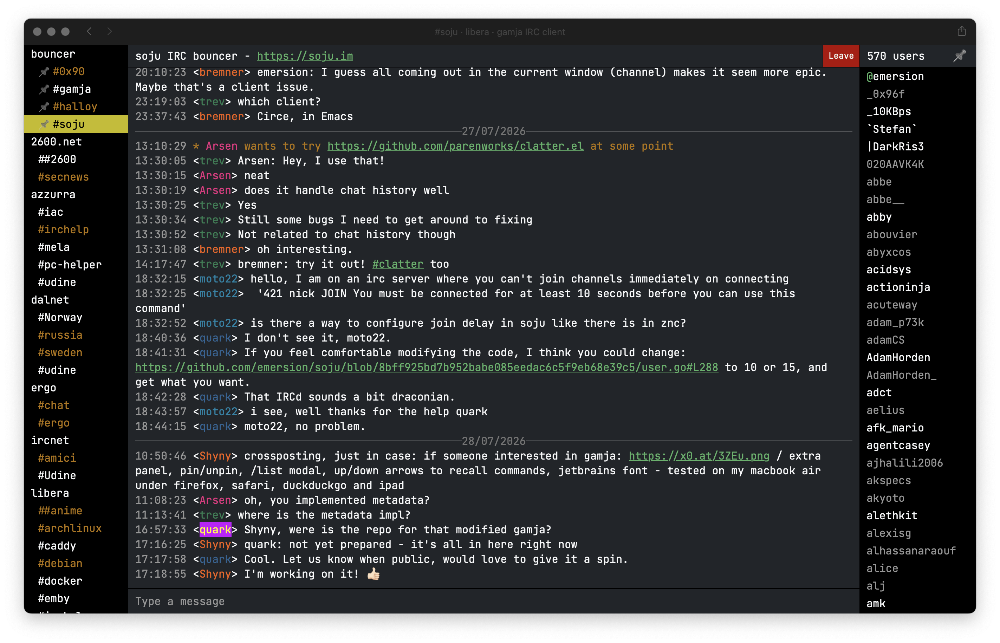
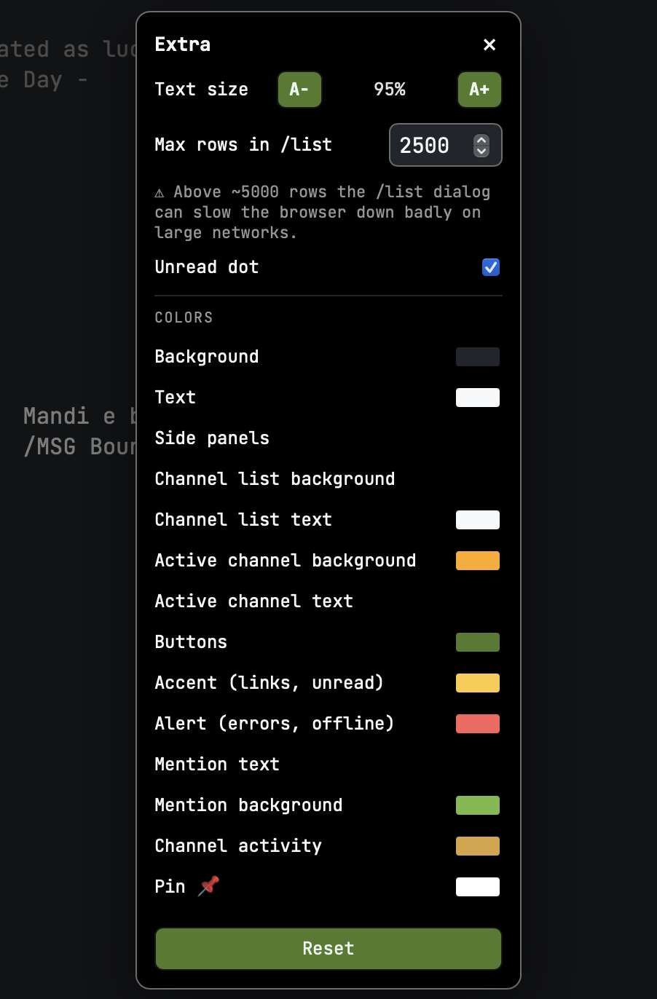

# gamja — customizations

A set of customizations for [gamja](https://codeberg.org/emersion/gamja), the web IRC client, as
used in front of a [soju](https://codeberg.org/emersion/soju) bouncer. Everything in `custom.css` +
`custom.js` is **zero-invasive**: no changes to gamja's bundle, no `WebSocket` wrapper, no
`MutationObserver` watching message rendering.

The one exception is the `/list` dialog, which needs **a small hook inside the bundle** (documented
below). Without it everything else still works and the dialog simply never opens.

Desktop only.

**Tested against gamja `master` at commit [`cdf94d6`](https://codeberg.org/emersion/gamja/commit/cdf94d6)
(2026-07-24).** Follow `master`, not the tags: the latest release, `v1.0.0-beta.11`, dates from
2025-03-20 and is 54 commits behind. Note that these customizations hook gamja's DOM and CSS
variables rather than a stable API, so a newer `master` may move things underneath them — the CSS
variable names and the injection points are the parts most likely to drift.



*Pinned channels at the top of the list, the 📌 next to the user count, unread dots on `##anime` and
`#archlinux`, JetBrains Mono and the dark theme.*

## What it adds

**"Extra" panel** — a button injected next to *Settings* in the bouncer view:

- **text zoom** A−/A+ (0.3× → 1.8×), applied through the `--fs` CSS variable
- **max rows in the `/list` dialog** (default 2000, range 100–50000) with a warning above 5000
- **unread dot**: a dot next to channels with activity or a mention, on by default, plus **which side
  it sits on** — end of the row by default, or in front of the name. Either way every row reserves
  the same strip for it, so the list keeps its alignment and the sidebar width does not change with
  which channels are active

The panel is two columns wide: fourteen colors in a single column turned it into a very tall strip.
The grid sits on the panel itself, so blocks that add their own rows through `gamja-extra-panel` get
full-width placement for free.
- **theme colors**, grouped by **where you see them** rather than by what the variable is called —
  *Channel list (left)*, *Member list (right)*, *Messages*, *Other*. The flat list used to put
  *Side panels* right next to *Channel list background* as if they were the same thing.

  Beyond what gamja exposes: `--bl-background` / `--bl-color` (background and text of the left
  channel list *only*, which gamja otherwise shares with the member list through
  `--sidebar-background`), `--bl-active-bg` / `--bl-active-color` (the selected channel,
  **hardcoded** to `#fff` in gamja), `--link-color` for links in messages — gamja paints those with
  `--green`, the very same variable as unread, so the two could never be set apart — and
  `--timestamp-color` for the time next to each message.
  `--green` is left with what it actually still drives, operators and online status, and `--red`
  is *Alert*.



**Channel pinning (senpai-style)** — a 📌 in the member list header, next to *N users*: pins the open
channel and floats it to the top of the channel list, right below the bouncer row, with a 📌 in front
of its name.

**Buffer reload (⟳)** — a button in the buffer header, in front of the channel topic. Every so often a
channel renders empty right after joining: the buffer is there, the messages are not. Switching to
another buffer and back brings them in, and this button does exactly that — it clicks gamja's own
sidebar links and returning, with a *reloading…* notice over the buffer while it happens.

The bounce needs a **real** buffer: gamja switches only between buffers it owns, and a hand-made
`<a>` carries none of its click handlers, so a synthetic "empty page" is not possible without a
bundle hook. Targets are tried in this order: a **scratch buffer** — open one once with
`/query reload` and it sits in the sidebar doing nothing, so the round trip marks nothing real as
read (rename it through `localStorage` key `gamja_reload_scratch`) — then the **server row of the
same network**, then any other buffer. The underlying defect (no history fetch on an empty buffer) is one of the optional
bundle fixes below, but it does not catch every case, so a manual retry is still worth having.

**`/list` dialog** — sortable channel list (by user count or name), filter on name and topic,
*shown / total* counter, click a row to join.

**Buffer search (⌘F / Ctrl+F)** — gamja has none. A dialog that filters the lines already rendered
in the active buffer: several words match in any order, case-insensitive, the matched term is
highlighted, `↑↓` moves through the results and Enter jumps to the line in the buffer, which flashes
an outline. It replaces the browser's own find while gamja has focus.

**Command history ↑/↓** in the composer, shell style (deduplicated, capped at 200 entries).

**Readable `/help`** — gamja renders the help dialog as `<dt>`/`<dd>` pairs but never styles them,
so every command comes out looking exactly like its own description. Commands now sit on a chip and
descriptions are dimmed. It also fixes gamja's `<kbd>` chips, which are unreadable here (see below).

**Working shortcuts on macOS** — gamja binds its shortcuts to `event.key`, but Option+letter on
macOS produces a composed character (`Option+h` is `˙`), so Alt+h and Alt+a simply do nothing there.
The physical key is read from `event.code` and the event is re-emitted with the right letter, so
gamja's own handler still does the work. `Option+k` is accepted as well for the buffer switcher,
which gamja binds to Ctrl — handy because macOS already claims Ctrl+K inside a text field. The
`/help` dialog shows the Mac symbols (`⌥`, `⌃`) next to the Windows names.

**Alt+↑/↓ follows the order you see** — with channels pinned, gamja's own navigation skips them as a
block, because it walks the internal buffer Map while pinning only reorders the view. Navigation is
redone on the visible order.

**Grouping of shared channel names** (*Extra* panel, off by default) — `#linux` on two networks used
to sit far apart in the list, indistinguishable. Switched on, every name present on more than one
network is lifted out of its network and gathered right below the pinned block under a *shared names*
caption, each row labelled `@network`. **The pin wins**: a pinned channel stays in the pinned block
even when its name is shared, it only gains the `@network` label so it cannot be confused with its
twin, which stays down in the group.

The network is not written anywhere on the `<li>`: it is derived from DOM order, by walking up to the
network row that precedes the channel. Ordering reuses the pinning mechanism (`style.order` plus
attributes preact does not manage), and the caption and the `@network` label are generated content,
so **no node is inserted** into the list.

**Row marks in the channel list** — networks get a `⚯` in front of the name and the bouncer row at
the top gets a 🐇, so servers read as a different kind of row than channels at a glance. Both are
swappable through the `--srv-icon` and `--bnc-icon` CSS variables. The network mark is a plain glyph
on purpose, so it takes `color` and follows the theme; the rabbit is an emoji and therefore ignores
it, like the 📌.

**Forced dark theme** with self-hosted JetBrains Mono.

## Install

1. Copy `custom.css`, `custom.js` and the `fonts/` directory into your gamja directory.
2. In `index.html`, **after** the bundle tags, add:

   ```html
   <link rel=stylesheet href="custom.css?v=1">
   <script src="custom.js?v=1"></script>
   ```

   The `?v=N` is cache busting: **bump it on every change**, otherwise browsers keep serving the old
   file. It also helps to serve `index.html`, `config.json`, `custom.css` and `custom.js` with
   `Cache-Control: no-store`.

3. Copy `config.json.example` to `config.json` and **replace the URL with your own bouncer's
   WebSocket endpoint** — the example value is a placeholder and connects to nothing:

   ```json
   {
     "server": {
       "url": "wss://YOUR-BOUNCER.example/socket",
       "auth": "mandatory"
     }
   }
   ```

   `auth` can be `mandatory` (always ask for credentials), `optional`, or `external` (client
   certificate). Nickname, autojoin channels and networks are configured in soju, not here.

   ⚠️ The WebSocket **must live on the same origin** as the gamja page. If the page's Origin does not
   match the WebSocket's Host, soju refuses the connection with
   *"request Origin ... is not authorized for Host ..."*.

4. For the `/list` dialog, apply the bundle hook below.

## Bundle hook for `/list`

gamja does not surface `LIST` numerics, so the dialog has to be fed by an event. In `build.*.js`,
inside `handleMessage`, right **after** the message is parsed (where the parsed-message variable
already exists — `s` in this build), insert:

```js
if ("322" === s.command) {
    (window.__gl = window.__gl || []).push({
        c: s.params[1],
        u: parseInt(s.params[2], 10) || 0,
        t: s.params[3] || ""
    });
    return;
} else if ("321" === s.command) {
    window.__gl = [];
    return;
} else if ("323" === s.command) {
    try {
        window.dispatchEvent(new CustomEvent("gamja-list", { detail: window.__gl || [] }));
    } catch (_e) {}
    return;
}
```

`321` starts the list, `322` is one row, `323` ends it. Returning early keeps those numerics out of
the message buffer. Cost: one string comparison per received message.

⚠️ Variable names are **minified and change on every build**: read them off your own bundle instead
of copying blindly. And rebuilding gamja **overwrites everything**, this hook included.

⚠️ If the bundle is served with a long `Cache-Control` (its name carries a content hash, so that is
the sane way to serve it), patching the file **in place is not enough** — browsers keep the cached
copy. Give the patched file a new name and point `index.html` at it; `index.html` itself must stay
`no-store`.

⚠️ **Do not wrap `window.WebSocket`** to intercept `/list`. The first iteration of this work did
exactly that, together with a document-wide observer, and the result was a sluggish gamja with
messages disappearing and reappearing.

## More

- [**Optional bundle fixes**](bundle-fixes.md) — three gamja defects worth patching in `build.*.js`:
  the undismissable *Open buffer* dialog, a slow `/join` yanking you out of the buffer you moved to,
  and history never loading on an empty buffer.
- [**Notes**](notes.md) — how the pieces hold together and the traps behind them: why nodes are
  re-injected on an interval instead of with a `MutationObserver`, the gamja rules declared only
  inside `@media (prefers-color-scheme: dark)`, why mobile was abandoned, what the unread dot can and
  cannot say.

## Licenses

`custom.css` and `custom.js` are original work. gamja itself is **AGPL-3.0** and is not included
here. **JetBrains Mono** is licensed under the **SIL Open Font License 1.1**; its license text ships
with the fonts in [`fonts/OFL.txt`](fonts/OFL.txt).
