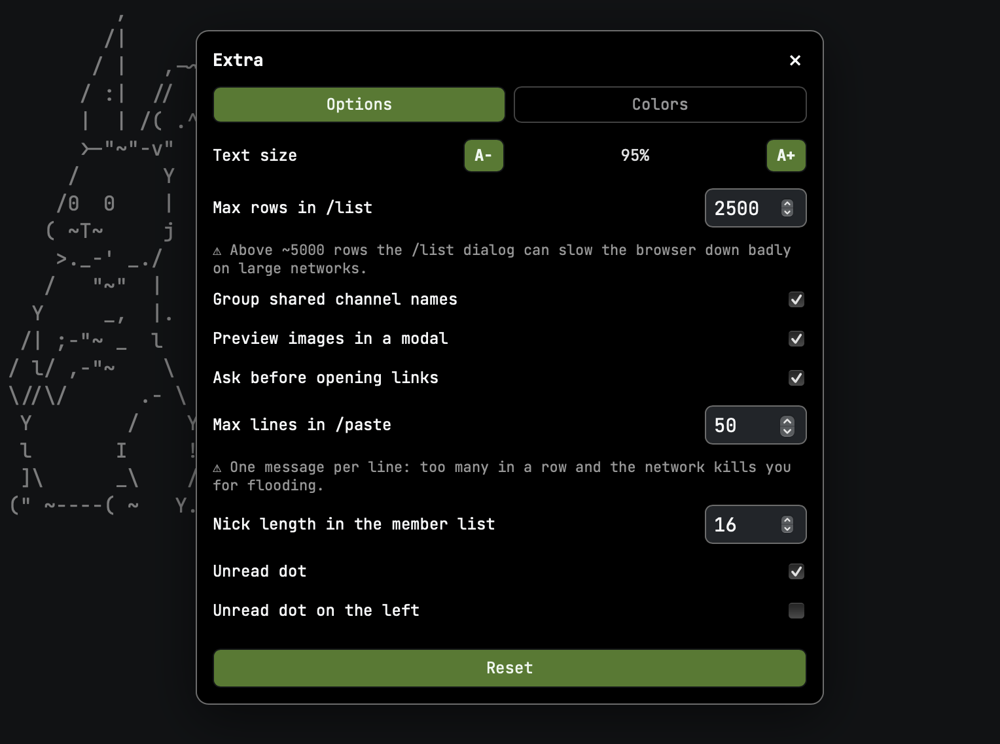
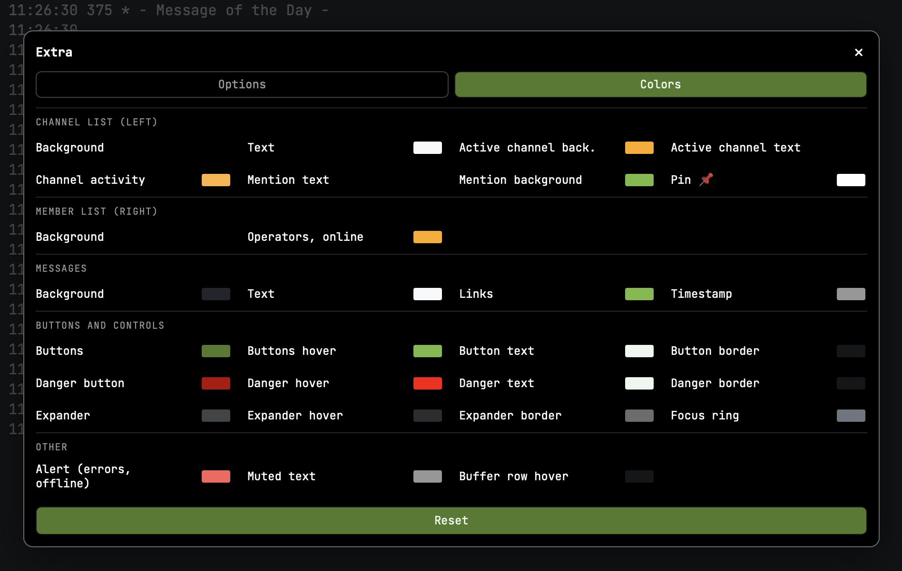

# gamja — customizations

Customizations for [gamja](https://codeberg.org/emersion/gamja), the web IRC client, as used in front
of a [soju](https://codeberg.org/emersion/soju) bouncer. `custom.css` + `custom.js` sit beside gamja's
bundle and never touch it, so they survive a rebuild — the one exception is the `/list` hook below.
Desktop only.

**Tested against gamja `master` at [`cdf94d6`](https://codeberg.org/emersion/gamja/commit/cdf94d6)
(2026-07-24).** Follow `master`, not the tags: the latest release, `v1.0.0-beta.11`, is from 2025-03-20
and 54 commits behind. These files hook gamja's DOM and CSS variables, not a stable API, so a newer
`master` can move things underneath them.


## What it adds

 

**"Extra" panel** — a button next to *Settings*, split into **Options** and **Colors** tabs. *Reset*
puts every setting and colour back to its default; pinned channels are left alone, being data rather
than a setting.

- **29 theme colours**, grouped by where you see them, including what gamja hardcodes: the selected
  channel, links (gamja paints them with the unread colour, so the two could never differ),
  timestamps, channel activity, the button/danger/expander sets, the focus ring
- text zoom, `/list` row cap, `/paste` line cap, nick length in the member list
- toggles: group shared channel names, unread dot and its side, image preview, link confirmation
- the **row marks** themselves — bouncer, network, shared names, private messages, link, image link —
  one glyph each, empty for the default

**Channel list** — 📌 in the member list header pins the open channel to the top; networks are marked
`⚯`, the bouncer row 🐇. **Private messages** get their own block under the pinned channels, sorted by
nick. Optionally, **names shared across networks** are lifted out into a *shared names* group, each row
reading `#channel@network`. A dot marks channels with activity, on either side, in a strip every row
reserves so the width never shifts with traffic. Long nicks are shortened, the full one staying in the
hover title.

**Buffer reload (⟳)** in the header, in front of the topic. A channel sometimes renders empty right
after joining and switching away and back brings it back; the button does that round trip by clicking
gamja's own sidebar links, bouncing off a scratch buffer if one exists (`/query reload`) so nothing
real is marked read.

**`/paste`** — gamja's composer is a single-line `<input>`, so a pasted block goes out as one message
with the newlines turned into spaces. The dialog sends **one line per message**, 450 ms apart to stay
clear of flood limits, or **as a link**: the text is uploaded to [dpaste.com](https://dpaste.com) and
only the URL is sent, expiring after 7 days. Opens by typing `/paste` (Tab completes it) or by itself
when multi-line text is pasted. Copying several lines out of a buffer also gets its newlines back.

⚠️ *Send as link* hands the text to a third party: whoever has the URL can read it, so it is a poor
place for anything private. dpaste was picked because the upload has to work from the browser alone,
and that needs the service to return **CORS headers** — without them the request goes out but the URL
in the answer cannot be read. Of the services tried, only dpaste.com and api.pastes.dev do (and only
when the request carries an `Origin`, which is why a `curl` test without one looks like a refusal);
0x0.st, envs.sh, ttm.sh, paste.c-net.org and pastebin.com do not. Nothing server-side is involved, and
gamja's CSP already allows `connect-src *`.

**Image preview and link confirmation**, both off by default — an image link opens in a modal scaled
to the window; other links can ask first, showing the host on its own line above the full address.
⚠️ The preview needs `img-src` in the page's CSP (see `index.html.example`): gamja ships
`default-src 'self'`, which blocks remote images outright. Allowed, clicking an image means gamja
fetches it, so your IP reaches that host. Nothing is preloaded, and inline thumbnails were left out on
purpose.

**`/list` dialog** — sortable channel list, filter on name and topic, click a row to join.

**Buffer search (⌘F / Ctrl+F)** — gamja has none. Filters the lines already rendered, `↑↓` walks the
matches, Enter jumps to the line.

**Hide repeated nicks** (*Options*) — a run of messages from the same person keeps the nick and the
timestamp on the first line only; anything that is not a message breaks the run. Hidden with
`visibility`, so the text stays in its column.

**Text shortcuts** — `:shrug`, `:tableflip` and `:unflip` become `¯\_(ツ)_/¯` and company, both when
you send them and in messages as they are displayed, so a token someone else typed reads the same way.
Tokens inside links are left alone.

**Command history ↑/↓** in the composer, shell style. **Readable `/help`**, whose `<dt>`/`<dd>` pairs
gamja never styles. **Working shortcuts on macOS**, where Option+letter yields a composed character
(`Option+h` is `˙`) and gamja's `event.key` bindings never fire. **Alt+↑/↓ follows the visible order**
instead of gamja's internal one, which skips pinned channels as a block.

**Forced dark theme** with self-hosted JetBrains Mono.

## Install

1. Copy `custom.css`, `custom.js` and `fonts/` into your gamja directory.
2. In `index.html`, **after** the bundle tags:

   ```html
   <link rel=stylesheet href="custom.css?v=1">
   <script src="custom.js?v=1"></script>
   ```

   Bump `?v=N` on every change, or browsers keep serving the old file. Serve `index.html`,
   `config.json`, `custom.css` and `custom.js` as `Cache-Control: no-store`; the bundle and the fonts
   carry a content hash in their name and can be cached forever.

3. Copy `config.json.example` to `config.json` and point it at your own bouncer's WebSocket endpoint.
   ⚠️ It **must be on the same origin** as the page, or soju refuses the connection (*"request Origin
   … is not authorized for Host …"*). Nick, autojoin and networks are configured in soju, not here.
4. For the `/list` dialog, apply the bundle hook below.

## Bundle hook for `/list`

gamja does not surface `LIST` numerics, so the dialog is fed by an event. In `build.*.js`, inside
`handleMessage`, right after the message is parsed (that variable is `s` in this build):

```js
if ("322" === s.command) {
    (window.__gl = window.__gl || []).push({
        c: s.params[1],
        u: parseInt(s.params[2], 10) || 0,
        t: s.params[3] || ""
    });
    return;
} else if ("321" === s.command) {
    window.__gl = [];
    return;
} else if ("323" === s.command) {
    try {
        window.dispatchEvent(new CustomEvent("gamja-list", { detail: window.__gl || [] }));
    } catch (_e) {}
    return;
}
```

`321` opens the list, `322` is one row, `323` ends it; returning early keeps them out of the buffer.

⚠️ Names are **minified and change on every build** — read them off your own bundle. Rebuilding gamja
**overwrites the hook**. And if the bundle is served with a long `max-age`, a patched file needs a
**new name** with `index.html` pointed at it, or the patch stays invisible.

⚠️ Do **not** wrap `window.WebSocket` to intercept `/list`. That was the first attempt, together with a
document-wide observer, and it left gamja sluggish with messages flickering in and out.

## More

- [**Optional bundle fixes**](bundle-fixes.md) — three gamja defects worth patching.
- [**Notes**](notes.md) — how the pieces hold together, and the traps behind them.

## Licenses

`custom.css` and `custom.js` are original work. gamja itself is **AGPL-3.0** and is not included here.
**JetBrains Mono** is under the **SIL Open Font License 1.1**, shipped with the fonts in
[`fonts/OFL.txt`](fonts/OFL.txt).
